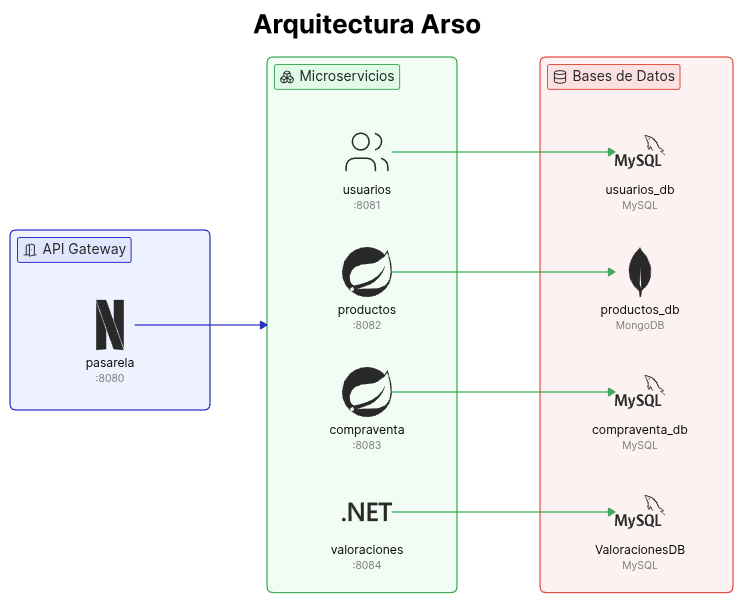
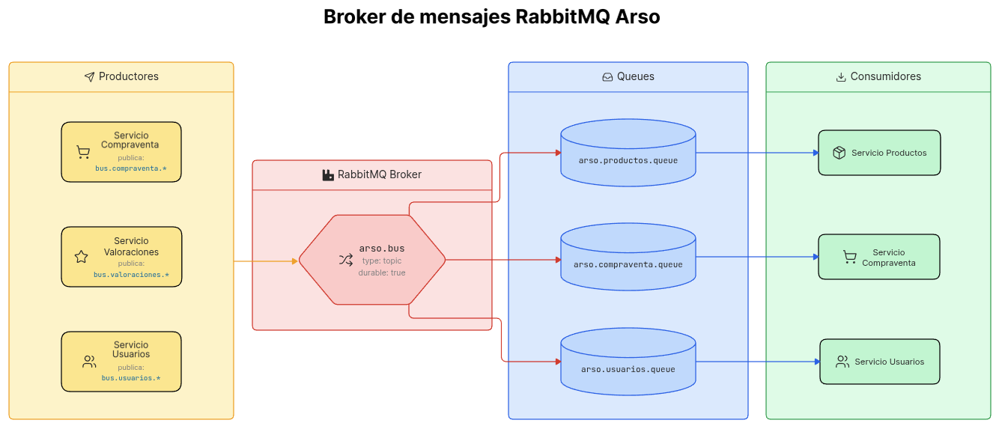

# arso

Prácticas de Arquitectura del Software. Grado en Ingeniería Informática 2025/2026.
Facultad de Informática. Universidad de Murcia.

## Acerca del proyecto

Este repositorio contiene el código necesario de la plataforma de compraventa de productos
especificado en el enunciado de las prácticas de la asignatura de Arquitectura del Software.

## Inicio rápido

### Requisitos

La única dependencia del proyecto es tener instalado:

- [Docker](https://www.docker.com/) y Docker Compose.

### Instalación

1. Clonar el repositorio

   ```sh
   git clone https://github.com/hsanchezm7/arso
   cd arso
   ```

2. Levantar la plataforma

   ```sh
   docker compose up -d --build
   ```

> [!NOTE]  
> La aplicación puede tardar varios minutos en iniciarse si es el primer arranque debido a la inicialización de datos.

## Arquitectura



La aplicación se divide usando microservicios definidos en un fichero [`compose.yml`](compose.yml)
de Docker. Cada uno de los servicios de la aplicación tiene su propio build especificado en un
Dockerfile multi-stage.

> [!NOTE]
> Debido a los altos tiempos de build de los servicios, el proyecto se ha desarrollado usando
> un `pom.xml` parent para usar las mismas versiones de las dependencias que sean posibles. Esto
> se combina usando la caché de Maven en los Dockerfiles.

| servicio      | directorio                             | puertos (host:contenedor)  | acceso                                      | credenciales     |
| ------------- | -------------------------------------- | -------------------------- | ------------------------------------------- | ---------------- |
| mongo         | -                                      | `27018:27017`              | -                                           | -                |
| mongo-express | -                                      | `8085:8085`                | [Ir](http://localhost:8085)                 | `admin:pass`     |
| rabbitmq      | -                                      | `5672:5672`, `15672:15672` | [Ir](http://localhost:15672)                | `arso:arso`      |
| mysql         | -                                      | `3307:3306`                | -                                           | `root:practicas` |
| pasarela      | [`pasarela/`](pasarela/)               | `8080:8080`                | -                                           | -                |
| usuarios      | [`usuarios/`](usuarios/)               | `8081:8081`                | -                                           | -                |
| productos     | [`productos/`](productos/)             | `8082:8082`                | [Ir](http://localhost:8082/swagger-ui.html) | -                |
| compraventa   | [`compraventa/`](compraventa/)         | `8083:8083`                | [Ir](http://localhost:8083/swagger-ui.html) | -                |
| valoraciones  | [`ValoracionesApi/`](ValoracionesApi/) | `8084:8084`                | [Ir](http://localhost:8084/swagger)         | -                |

> [!TIP]
> Se recomienda leer la documentación `README.md` de cada microservicio para conocer más
> acerca de cada uno de ellos.

## Datos inicializados

La base de datos se inicializa con un script en [`seeder/`](./seeder/), donde se indican todos
los usuarios creados. Los usuarios principales son los siguientes:

| Email           | Clave   | Nombre      | Apellidos | Roles           |
| --------------- | ------- | ----------- | --------- | --------------- |
| `admin@arso.es` | `admin` | Arso        | Admin     | "USUARIO,ADMIN" |
| `arso1@arso.es` | `arso1` | Arso Prueba | 1         | "USUARIO"       |

## Broker de mensajes RabbitMQ

En el fichero [`definitions.json`](./definitions.json) se declaran el bus, las colas y los bindings
necesarios en la arquitectura. Esto ayuda a crear las conexiones en el arranque de la plataforma
En dicho fichero se definen también el usuario y la contraseña de RabbitMQ (`arso:arso`).

Los eventos consumidos y producidos por cada microservicio se especifican en el README de su
directorio.



## Autenticación y OAuth

La pasarela está configurada con dos tipos de autenticaciones, vía login normal (`/auth/login`) y
vía OAuth de GitHub (`/oauth2/authorization/github`). [Ver más](pasarela/README.md).

El microservicio usuarios mantiene una relación entre el email y el githubId, ya que un usuario
registrado con un email puede iniciar sesión con GitHub si usa el mismo email. Por tanto, es
necesario establecer el email público en GitHub para la correcta autenticación vía OAuth. De otra
forma, GitHub lo oculta a la aplicación.

Se han dejado públicas las variables `GITHUB_CLIENT_ID` y `GITHUB_CLIENT_SECRET` pues sus permisos
se limitan al servidor OAuth y no suponen mayor riesgo.

## Acerca del entorno

Aunque sea una mala práctica, se hace uso de un fichero [`.env`](./.env) para las variables
de entorno. Se asume que este proyecto tiene una finalidad académica aunque no sería lo
correcto en producción.

## Adecuación de los requisitos

Con motivo de adaptar el backend a las prácticas de la asginatura de desarrollado de
Aplicaciones Web, se han realizado una serie de cambios respecto al enunciado de la
práctica. Algunos de ellos:

- Imágenes de productos: un usuario puede añadir una imagen cualquiera en forma de URL a cualquiera
  de sus productos. Dicha imagen es añadida en forma de URL. Esta propiedad es opcional.

- Eliminación de productos: un usuario puede eliminar cualquiera de sus productos de forma
  completa. Requiere que el producto no haya sido vendido.

## Pruebas Postman

Las pruebas en Postman incluidas en [`postman/`](./postman/) están formadas por una serie de colecciones,
cada una relativa a un microservicio, y un entorno. Éste último es necesario para ir estableciendo las
variables necesarias para probar los endpoints.

Mediante scripts de Postman, se extraen los datos de los cuerpos de las respuestas o de las cabeceras
(como `Location` gracias a HATEOAS). De todas formas, algunas variables deben ser establecidas manualmente,
como la categoría. Se recomienda seguir el siguiente flujo entre colecciones:

1. **auth** (pararela y usuarios)

2. **usuarios**

3. **productos**

4. **compraventas**

5. **usuarios** y **productos** nuevamente para visualizar los cambios en las entidades ante los posibles
   eventos emitidos por la colección anterior
